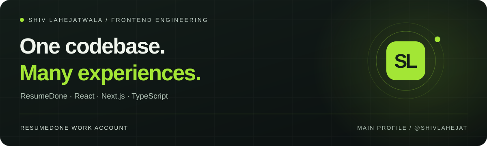

# Shiv Lahejatwala

**Frontend Team Lead on ResumeDone · Senior Software Developer & Technical Lead at Multi Code Genius**

I'm Shiv, also known as **Shiv Lahejat**, a software developer based in Surat, India. I use this account for my **ResumeDone work**.

**[My main GitHub profile → @shivlahejat](https://github.com/shivlahejat)** · [Portfolio](https://shivlahejat.vercel.app/) · [LinkedIn](https://www.linkedin.com/in/shiv-lahejatwala-b8a638249/)

---

## One product platform, multiple brands

ResumeDone is a resume-building platform with creation, import and template-selection experiences. Our shared codebase serves multiple domain variants, including **ResumeDone, CV Lite, CVToolsPro, CV Machine and CV for Success**.

My role is to guide frontend delivery across those experiences: the components people use, the patterns engineers build on, and the releases that bring the work together.

**[Explore the ResumeDone case study →](https://shivlahejat.vercel.app/work/resumedone)** 
Product walkthroughs, brand examples and the scope of my contribution.

## What I contribute

### Frontend direction
Assign and review work, guide technical decisions, and coordinate frontend delivery across the platform and its domain variants.

### Shared interfaces
Own reusable component patterns and the design system that support consistent resume creation and import flows across brands.

### Performance & releases
Work on frontend performance through code splitting, lazy loading, image optimisation and bundle analysis, alongside release delivery.

### Team development
Mentor engineers through reviews and hands-on training, and help new team members work with our component patterns and quality standards.

## My working toolkit

**Interface:** `React` `Next.js` `TypeScript` `JavaScript` 
**Application:** reusable components, shared state, API integrations and responsive layouts 
**Delivery:** code review, frontend performance, design systems and release coordination

## Engineering, in writing

[**Reusable UI needs clear state ownership →**](https://shivlahejat.vercel.app/notes/shared-ui-state) 
An engineering note connected to my work on shared React interfaces.

[More engineering notes](https://shivlahejat.vercel.app/notes) · [Experience & background](https://shivlahejat.vercel.app/experience)

---

### Looking for my other work?

My broader portfolio covers web platforms, ecommerce, mobile applications and conversational AI.

**[Explore all projects →](https://shivlahejat.vercel.app/work)** · **[Visit @shivlahejat →](https://github.com/shivlahejat)**

[Get in touch](https://shivlahejat.vercel.app/contact) · [shivlahejat123@gmail.com](mailto:shivlahejat123@gmail.com)
